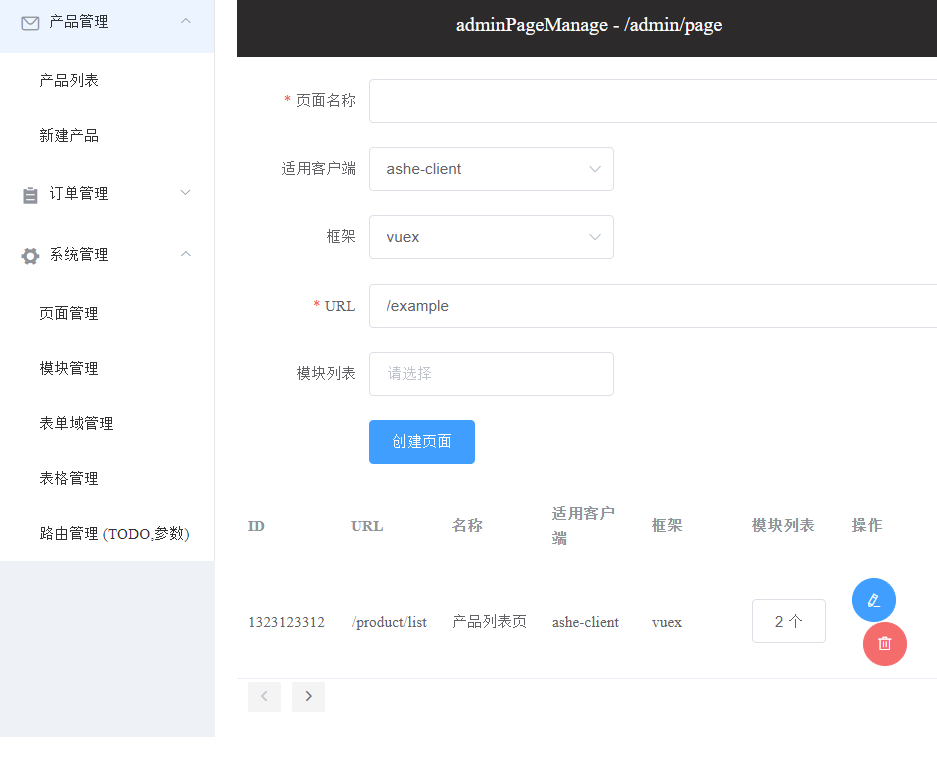
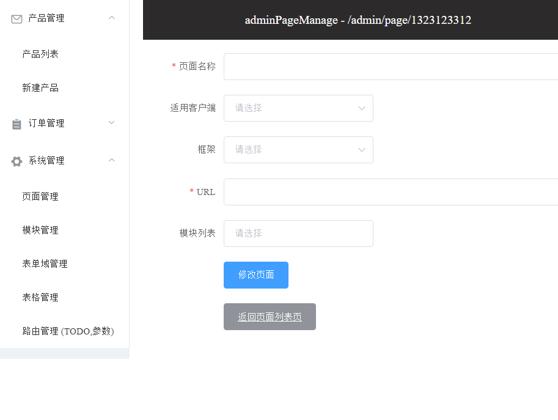
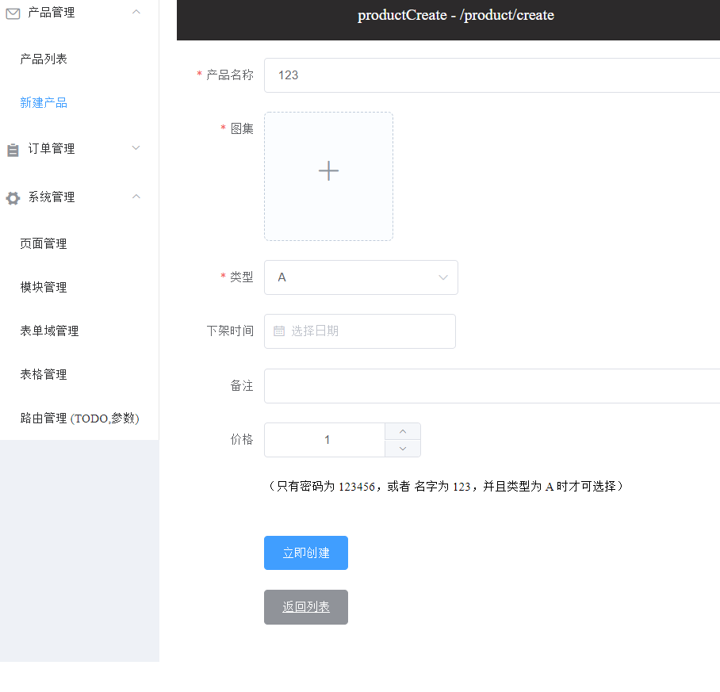
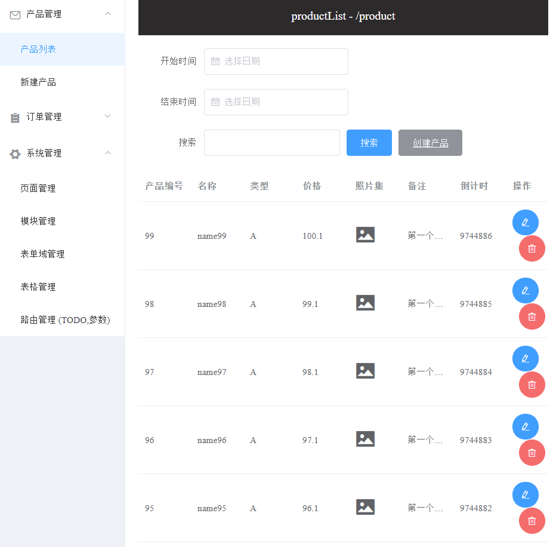

# 技术文档

> 暂时还有 page creator 还没有完成，基于 schema 生成配置，来生成 admin 的 page creator 里面所有组件配置 [试验](./server/playground.js)

## 分层架构

### server 部分 (server)

-   **model** 这一次通过数据库产生一些模型，期望是使用 mongoose 来做，但是定义协议太耗时了
-   **controller** 主要的业务逻辑
-   **route** 暴露 api 与 schema 两种路由

### core 部分 (domain)

> 面向 DDD， 单向依赖关系： frameworks -> adapters -> useCases —> (services|entities)，向外部暴露 framework 来导出 adapter

-   **services** api 服务 [详细](./core/src/services/README.md)
-   **entities** 业务实体 [详细](./core/src/entities/README.md)
-   **useCases** 用例 [详细](./core/src/useCases/README.md)
-   **adapters** 适配器 [详细](./core/src/adapters/README.md)
-   **frameworks** 框架 [详细](./core/src/frameworks/README.md)

### client 部分 (presenter)

-   **components** 各种组件

## 流程图

-   https://www.processon.com/view/link/5dc2a16fe4b04913a28ce076

### 关于 schema

#### 概念描述

-   **page 页面** 由模块（model）组成
-   **module 模块** 有 generator 组件生成，分为两种类型 form / table
-   **field 表单域** 构成 form module 的元素，其由 component 组成
-   **column 表格列** 构成 table module 的元素，其由 component 组成
-   **component 组件** 构成 field 或者 column，每个组件也有自己的协议

#### 协议的存储

1. 储存 表现层与业务层 上传协议
    - 所有的 adapter(getter/action) / generator / component 的 schema 均需要手动上传至服务器
2. 使用 page creator 生成页面协议 [创建页面](https://www.processon.com/view/link/5dc2a16fe4b04913a28ce076)
3. 储存生成的 page / module / field / column / route（TODO 我就得路由也应该关系起来，创建页面的时候应该是选择 url，而不是输入 url）

## page demo

### 页面创建及列表

### 页面编辑

### 产品创建

### 产品列表

